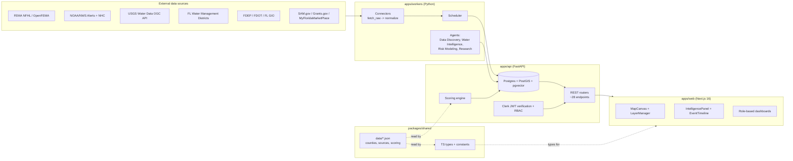

# FIRIP Architecture

FIRIP (Florida Risk + Water Intelligence Platform) is a monorepo with a
TypeScript frontend, a Python backend, a Python worker/agent runtime, and a
single set of JSON data files that both languages read at runtime so the
scoring model, county registry, and data-source registry can never drift
between the map UI and the API.

## System diagram

## Components

### `packages/shared` — cross-language single source of truth

- `data/counties.json` — all 67 Florida counties (FIPS, name, region, water
  management district membership, GIS/procurement/permits/parcels URLs,
  license, `data_quality_status`).
- `data/sources.json` — the federal/state/regional data source registry
  (21 entries: FEMA, NOAA/NWS/NHC, USGS, the 5 FL water management
  districts, FDEP, FDOT, the statewide GIS portal, and procurement/grants
  sources).
- `data/scoring.json` — risk-scoring factor weights, model version, and
  grade thresholds. This is the **only** place these numbers are defined;
  `packages/shared/src/constants/scoring.ts` and
  `apps/api/app/core/registry.py` (or equivalent scoring module) both load
  this file rather than hardcoding weights, so the web explanation panel
  and the persisted backend score can never disagree about how a grade was
  computed.
- `src/types/*.ts` — TypeScript types for every API resource, mirroring the
  Pydantic schemas in `apps/api/app/schemas`.

### `apps/api` — FastAPI backend

- Async SQLAlchemy 2.x models against Postgres + PostGIS (geometry columns)
  + pgvector (document embeddings), with Alembic migrations.
- REST routers implementing the documented contract: success responses are
  the plain resource (HTTP 200/201, `response_model=`), and only failures
  use the `{"success": false, "error": {"code", "message", "details"}}`
  envelope, produced by one global exception handler
  (`app/core/errors.py`).
- Connectors for each external source, split into `fetch_raw()` and
  `normalize()` so unit tests can exercise parsing against recorded
  fixtures without live network access. Connectors never fabricate data on
  upstream failure — a failed or rate-limited fetch is recorded in
  `source_runs` / `data_quality_events` and surfaced as "degraded," never
  silently substituted.
- Clerk-issued JWTs are verified against Clerk's JWKS endpoint; a
  `AUTH_DEV_BYPASS` environment flag exists for local development only and
  must never be enabled in a deployed environment.

### `apps/workers` — ingestion + agents

- A scheduler that runs each connector on its source's documented refresh
  cadence (see `sources.json`).
- Agents: Data Discovery (fills in `needs_verification` registry fields
  over time), Water Intelligence, Risk Modeling (recomputes property/county
  scores from `scoring.json`), and Research (RAG over `documents` /
  `embeddings`, behind a pluggable `LLMProvider` interface that returns an
  honest "not configured" response when no `OPENAI_API_KEY` /
  `GEMINI_API_KEY` is set, rather than fabricating an answer).
- Procurement and Construction agents are scaffolded but intentionally
  **not** wired into the scheduler in this MVP — per the product plan,
  Risk + Water is the first acceptance gate, not procurement.

### `apps/web` — Next.js 16 frontend

- Dark, map-first "terminal" UI: `MapCanvas` (Mapbox GL JS v3), a
  `LayerManager` for toggling flood/weather/water/risk/hurricane layers, an
  `IntelligencePanel` for the selected property/county, and an
  `EventTimelineDrawer` for alerts/advisories.
- Role-based dashboards (executive, government, engineering, contractor,
  investor, emergency management) consuming the same REST contract as
  every other client.
- Clerk for auth; both the Clerk provider and the route-protecting
  middleware degrade to a no-op when Clerk environment variables are
  unset, so `next build`/`next dev` never hard-depend on reaching Clerk.
- Hand-written Radix UI primitives (`components/ui`) instead of the shadcn
  CLI, and no `next/font/google`, so the production build has zero
  build-time network dependency.

## Data flow for a risk score

1. A connector in `apps/api/app/connectors` fetches raw FEMA/NOAA/USGS/WMD
   data and normalizes it into `flood_zones`, `weather_alerts`,
   `water_observations`, etc.
2. The Risk Modeling agent (or, for an on-demand request, the scoring
   service inline) reads `scoring.json`'s weights, computes each factor's
   `normalized_score`, and combines them into a 0-100 `score` and an A-F
   `grade` via `scoreToGrade`.
3. The result is persisted to `property_risk_scores` /
   `county_risk_scores` with a `model_version` stamp and an `explanation`
   string, and served via `GET /properties/{id}/risk` /
   `GET /counties/{fips}/risk`.
4. `apps/web`'s `IntelligencePanel` renders the same `RiskFactor[]` list the
   backend persisted — it never recomputes the score client-side.
